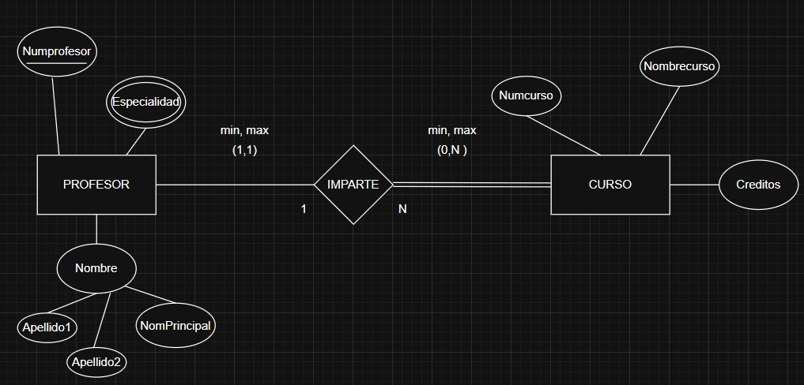
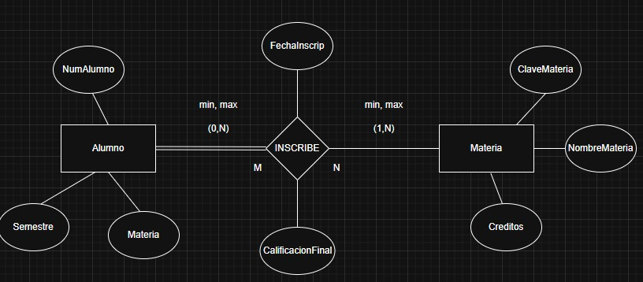
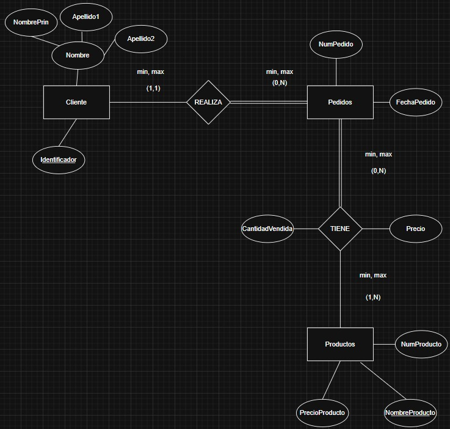
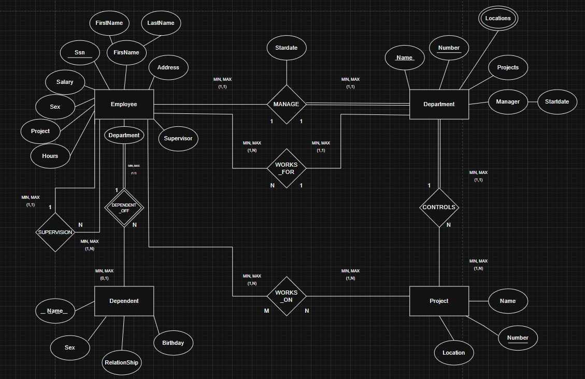

# Ejercicio del modelo E-R

## Ejercicio 1.

Un hospital registra información de sus pacientes.
> De cada paciente se almacena lo siguiente:
- Identificador
- Nombre
- Fecha de nacimiento

> De cada expediente médico se debe almacenar:
- Número de expediente.
- Fecha de apertura.
- Tipo de sangre.

> Reglas del negocio:
- Cada paciente debe tener exactamente un expediente médico.
- Cada expediente médico pertenece a un único paciente.
- No puede existir un expediente sin paciente.
- No puede existir un paciente sin expediente.

## Solucion del ejercicio 1

## Ejercicio 2

Una universidad administra profesores y cursos

>De cada profesor se almacena:

- numero de Profesor 
- Nombre
- especialidad

>De cada curso se almacena 

- Numero de Curso
- Nombre del Curso
- Creditos

>Reglas del negocio

1. Un profesor puede impartir varios cursos
2. Un curso solamnete puede ser impartido por un profesor
3. Puede exitir un profesor que actualmente no imparta cursos
4. Todo curso debe estar asignado a un profesor 

>Lo que se debe realizar:

- Identificar y Dibujar las Entidades 

-Identificar y Dibujar la Relacion 
**IMPARTE**
-Determinar la razon de cardinalidad 
-Determinar la Participacion

## Solucion del ejercicio 2

## Ejercicio 3

Una escuela administra alumnos y materias 

>De cada alumno se almacena:

-Matricula
-Nombre
- Semestre 

>De cada materia se almacena:

- Clave de la materia 
- Nombre de la Materia
- Creditos

>Reglas del negocio

1. Un alumno puede inscribirse en varias materias
2. Una materia puede tener muchis alumnos inscritos 
3. Puede existir una materia sin alumnos inscritos
4. Todo alumno debe estar inscrito en almenos una materia 
5. De cada inscripcion se desea almacenar:
    
    -Fecha de inscripcion 
    -Calificacion final 

Nota: La relacion se debe llamar 
**INSCRIBE**

## Solucion del ejercicio 3

## Ejercicio 4

Una empresa se dedica a la venta de productos al por mayor, y necesita registrar lo siguiente:

> De los clientes se necesita almacenar:

- Identificador del cliente
- Nombre del cliente, el cual es una persona moral

> De los pedidos de venta:

- Numero de pedido
- Fecha del pedido

> De los productos:

- Numero de producto
- Nombre del producto
- Precio del producto

1. Un cliente puede realizar muchos pedidos
2. Cada pedido pertenece a un solo cliente
3. Un pedido contiene varios productos
4. Un producto puede parecer en muchos pedidos 
5. Un pedido debe contener al menos un producto
6. Un producto puede no haber sido vendido
7. El detalle del pedido no existe sin pedido(detalles de la venta)
8. El detalle del pedido no existe sin producto
9. El detalle del pedido almacena cantidad vedida y precio de venta

## Solucion del ejercicio 4

## Ejercicicio 5

A company wants to design a database to track its internal operations, including employees, departments, projects, and dependents. 

The requirements are specified below:
1. EmployeesEach Employee is identified by a unique Social Security Number (Ssn).We also store the employee's Salary, Sex, Address, and a composite name consisting of FirstName and LastName.An employee can be supervised by another employee. This is a 1-to-N SUPERVISION relationship where one supervisor can manage multiple subordinates, but an employee has at most one direct supervisor.

2. DepartmentsEach Department is identified by a unique Number and a unique Name.A department can have multiple Locations (multivalued attribute).MANAGE Relationship: Each department is managed by exactly one employee (Manager), and an employee can manage at most one department. We need to track the Startdate when the employee started managing the department.WORKS_FOR Relationship: Each employee must work for exactly one department, while a department can have multiple employees ($1$ to $N$).
3. ProjectsEach Project is unique and identified by a Number and a Name. Each project is controlled at a single Location.CONTROLS Relationship: Each department controls multiple projects ($1$ to $N$), but each project is controlled by exactly one department.WORKS_ON Relationship: Employees can work on multiple projects, and a project can have multiple employees assigned to it ($M$ to $N$). For this relationship, we need to keep track of the number of Hours an employee works on a specific Project.

4. DependentsFor insurance or benefits purposes, we keep track of the dependents of each employee.Each Dependent has a Name, Sex, Birthday, and a Relationship to the employee.Dependent is a weak entity type that is dependent on the Employee entity via the DEPENDENT_OF relationship. A dependent cannot exist without an associated employee. An employee can have zero or more dependents, but a dependent belongs to exactly one employee.

## Solucion del ejercicio 5

