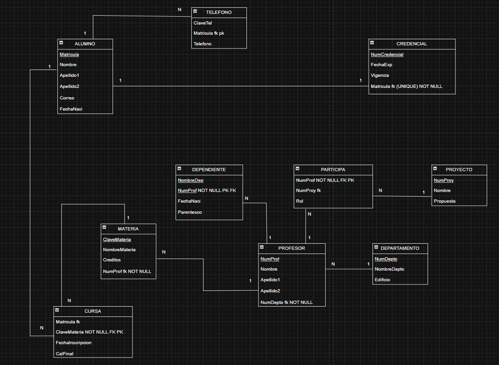

# Diccionario de Datos de bases de datos control escolar (ejercicio largo)

1. Informacion General

| Elemento 1 | Valor |
| :--- | :--- |
| Proyecto | Sistema de Control Escolar Integral |
| Version | 1.0 |
| Fecha | Junio 2026 |
| Elaboro | Jimena Valdez Delgadillo |
| SGBD | SQLServer |

2. Descripcion del Sistema de Base de Datos

El sistema administra:

- Alumnos y sus Datos de Contacto (Alumno, Telefono)
- Credenciales de Acceso (Credencial)
- Historial Académico e Inscripciones (Materia, Cursa)
- Profesores y sus Dependientes (Profesor, Dependiente)
- Estructura Organizacional (Departamento)
- Proyectos de Investigación y Participación (Proyecto, Participa)

Permite controlar todo el ciclo escolar, desde la información de contacto y seguridad del estudiante, el flujo de inscripciones y calificaciones, hasta la organización de los profesores en departamentos y su participación en proyectos institucionales.

3. Catalogo de Restricciones 

| Codigo  | Significado |
| :--- | :--- |
| PK | Primary key |
| FK | Foreign key |
| NN | Not Null |
| UQ | Unique |
| AI | Auto increment |
| CK | Check |
| DF | Default |

4. Diccionario de Datos

**Tabla:** Alumno

**Descripcion:** _Almacena los datos básicos y personales de los estudiantes_

| Campo | Tipo | Longitud | Restricciones | Descripcion |
| :--- | :--- | :--- | :--- | :--- |
| Matricula | INT | - | PK, NN | Matrícula única asignada al alumno (Identificador) |
| Nombre | VARCHAR | 30 | NN | Nombre(s) del estudiante |
| Apellido1 | VARCHAR | 20 | NN | Primer apellido del alumno |
| Apellido2 | VARCHAR | 20 | NULL | Segundo apellido del alumno |
| Correo | VARCHAR | 50 | NN | Correo electrónico de contacto |
| FechaNaci | DATE | - | NN | Fecha de nacimiento del alumno |

--- 

**Tabla:** Telefono

**Descripcion:** _Entidad débil que almacena los números telefónicos asociados a los alumnos_

| Campo | Tipo | Longitud | Restricciones | Descripcion |
| :--- | :--- | :--- | :--- | :--- |
| ClaveTel | INT | - | PK, NN | Identificador numérico del teléfono (Parte de la PK compuesta) |
| Matricula_fk | INT | - | PK, FK, NN | Matrícula del alumno al que pertenece el número |
| Telefono | VARCHAR | 15 | NN | Número telefónico completo |

---

**Tabla:** Credencial

**Descripcion:** _Almacena la información de las credenciales de identificación escolar de los alumnos_

| Campo | Tipo | Longitud | Restricciones | Descripcion |
| :--- | :--- | :--- | :--- | :--- |
| NumCredencial | INT | - | PK, NN | Número identificador único de la credencial |
| FechaExp | DATE | - | NN | Fecha de expedición del documento |
| Vigencia | DATE | - | NN | Fecha de vencimiento de la credencial |
| Matricula_fk | INT | - | FK, UQ, NN | Matrícula del alumno asociado (Restricción UNIQUE para asegurar relación 1:1) |

---

**Tabla:** Cursa

**Descripcion:** _Tabla intermedia que registra el historial de materias inscritas por los estudiantes y sus notas_

| Campo | Tipo | Longitud | Restricciones | Descripcion |
| :--- | :--- | :--- | :--- | :--- |
| Matricula_fk | INT | - | PK, FK, NN | Clave foránea del alumno que cursa la materia |
| ClaveMateria | INT | - | PK, FK, NN | Clave foránea de la materia inscrita |
| FechaInscripcion | DATE | - | NN | Fecha exacta en la que se realizó la inscripción |
| CalFinal | DECIMAL | 4,2 | NULL | Calificación definitiva obtenida al concluir el curso |

---

**Tabla:** Materia

**Descripcion:** _Almacena el catálogo de asignaturas disponibles en los planes de estudio_

| Campo | Tipo | Longitud | Restricciones | Descripcion |
| :--- | :--- | :--- | :--- | :--- |
| ClaveMateria | INT | - | PK, NN | Identificador único de la asignatura |
| NombreMateria | VARCHAR | 50 | NN | Nombre oficial de la materia |
| Creditos | INT | - | NN | Créditos académicos asignados a la materia |
| NumProf_fk | INT | - | FK, NN | Clave del profesor titular asignado a impartir la materia |

---

**Tabla:** Dependiente

**Descripcion:** _Entidad débil que almacena la información de los dependientes o familiares de los profesores_

| Campo | Tipo | Longitud | Restricciones | Descripcion |
| :--- | :--- | :--- | :--- | :--- |
| NombreDep | VARCHAR | 50 | PK, NN | Nombre completo del dependiente (Parte de la PK compuesta) |
| NumProf_fk | INT | - | PK, FK, NN | Número del profesor con quien tiene el vínculo familiar |
| FechaNaci | DATE | - | NN | Fecha de nacimiento del dependiente |
| Parentesco | VARCHAR | 30 | NN | Tipo de relación o parentesco (Hijo, Cónyuge, etc.) |

---

**Tabla:** Profesor

**Descripcion:** _Almacena los datos generales e institucionales del personal docente_

| Campo | Tipo | Longitud | Restricciones | Descripcion |
| :--- | :--- | :--- | :--- | :--- |
| NumProf | INT | - | PK, NN | Identificador único del profesor |
| Nombre | VARCHAR | 30 | NN | Nombre(s) del profesor |
| Apellido1 | VARCHAR | 20 | NN | Primer apellido del profesor |
| Apellido2 | VARCHAR | 20 | NULL | Segundo apellido del profesor |
| NumDepto_fk | INT | - | FK, NN | Clave del departamento académico al que está adscrito |

---

**Tabla:** Participa

**Descripcion:** _Tabla intermedia que gestiona la asignación y rol de los profesores en proyectos de investigación_

| Campo | Tipo | Longitud | Restricciones | Descripcion |
| :--- | :--- | :--- | :--- | :--- |
| NumProf_fk | INT | - | PK, FK, NN | Clave foránea del profesor que participa en el proyecto |
| NumProy_fk | INT | - | PK, FK, NN | Clave foránea del proyecto de investigación |
| Rol | VARCHAR | 50 | NN | Función o cargo asignado al profesor dentro del proyecto |

---

**Tabla:** Proyecto

**Descripcion:** _Almacena los proyectos o propuestas de investigación registrados en la institución_

| Campo | Tipo | Longitud | Restricciones | Descripcion |
| :--- | :--- | :--- | :--- | :--- |
| NumProy | INT | - | PK, NN | Identificador único del proyecto |
| Nombre | VARCHAR | 100 | NN | Título o nombre del proyecto |
| Propuesta | VARCHAR | 255 | NULL | Resumen, justificación o estatus de la propuesta del proyecto |

---

**Tabla:** Departamento

**Descripcion:** _Almacena los departamentos académicos de la institución escolar_

| Campo | Tipo | Longitud | Restricciones | Descripcion |
| :--- | :--- | :--- | :--- | :--- |
| NumDepto | INT | - | PK, NN | Identificador único del departamento |
| NombreDepto | VARCHAR | 50 | NN | Nombre oficial del departamento académico |
| Edificio | VARCHAR | 20 | NULL | Localización física o edificio donde se encuentra el departamento |

---

5. Relaciones

| Relacion | Cardinalidad | Descripcion |
|:----------|:---------:|----------:|
| Alumno -> Telefono      | 1:N     | Un alumno puede registrar varios números telefónicos. |
| Alumno -> Credencial    | 1:1     | Un alumno cuenta con una única credencial vigente. |
| Alumno -> Cursa         | 1:N     | Un alumno puede cursar muchas materias a lo largo del tiempo. |
| Materia -> Cursa        | 1:N     | Una materia es cursada por muchos alumnos de forma simultánea. |
| Profesor -> Materia     | 1:N     | Un profesor puede tener a su cargo el dictado de varias materias. |
| Profesor -> Dependiente | 1:N     | Un profesor puede declarar a varios dependientes familiares. |
| Departamento -> Profesor| 1:N     | Un departamento agrupa a muchos profesores adscritos. |
| Profesor -> Participa   | 1:N     | Un profesor puede participar en distintos proyectos de investigación. |
| Proyecto -> Participa   | 1:N     | Un proyecto recibe la colaboración de varios profesores. |

6. Matriz de Claves Foraneas 

| Tabla  | Campo Fk | Descripcion |
|:----------|:---------:|----------:|
| Telefono    | Matricula_fk  | Alumno (Matricula) |
| Credencial  | Matricula_fk  | Alumno (Matricula) |
| Cursa       | Matricula_fk  | Alumno (Matricula) |
| Cursa       | ClaveMateria  | Materia (ClaveMateria) |
| Materia     | NumProf_fk    | Profesor (NumProf) |
| Dependiente | NumProf_fk    | Profesor (NumProf) |
| Profesor    | NumDepto_fk   | Departamento (NumDepto) |
| Participa   | NumProf_fk    | Profesor (NumProf) |
| Participa   | NumProy_fk    | Proyecto (NumProy) |

7. Integridad Referencial

| Regla  | Descripcion |
| :--- | :--- |
| IR-01 | No se puede registrar un teléfono si la matrícula del alumno no existe en el sistema |
| IR-02 | No se puede generar una credencial si la matrícula del alumno es inexistente |
| IR-03 | Las relaciones en la tabla Cursa exigen la existencia previa del Alumno y de la Materia |
| IR-04 | Toda materia registrada debe tener asignado obligatoriamente un número de profesor válido |
| IR-05 | No se permiten registros de familiares si el código del profesor no se encuentra dado de alta |
| IR-06 | Los profesores deben asignarse a departamentos previamente creados |
| IR-07 | La participación de proyectos en la tabla Participa requiere que el profesor y el proyecto existan vigentes |

8. Reglas del Negocio

| Codigo  | Regla |
| :--- | :--- |
| RN-01 | La relación entre Alumno y Credencial es estrictamente 1:1, asegurada por el índice UNIQUE en la clave foránea |
| RN-02 | Las entidades débiles (Telefono y Dependiente) dependen totalmente de sus entidades fuertes correspondientes para formar su clave compuesta |
| RN-03 | Los roles desempeñados en los proyectos de investigación deben detallarse textualmente en cada asignación de la tabla Participa |

9. Modelo relacional

