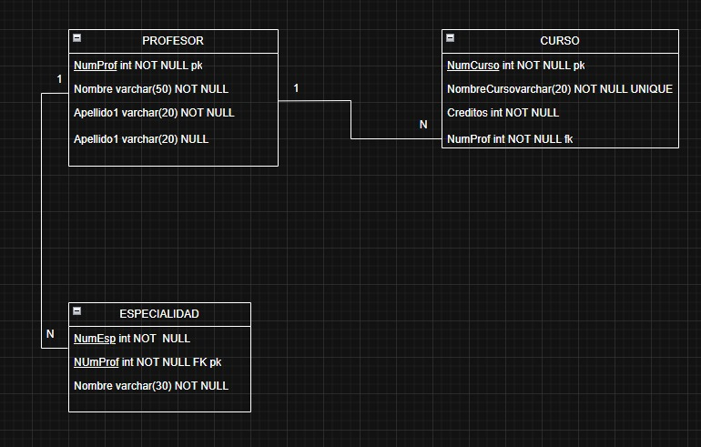

# Ejercicios Relacional 1

## Solucion del ejercicio

## Mapeo E-R Relacional

1. Diccionario de datos

**Tabla:** Profesor

| Campo     | Tipo    | Longitud | Restricciones | Descripcion                                                   |
| :-------- | :------ | :------- | :------------ | :------------------------------------------------------------ |
| NumProf   | INT     | -        | PK, NN        | Identificador único del profesor                              |
| Nombre    | VARCHAR | 50       | NN            | Nombre del profesor                                           |
| Apellido1 | VARCHAR | 20       | NN            | Primer apellido del profesor                                  |
| Apellido2 | VARCHAR | 20       | NULL          | Segundo apellido del profesor (Corregido del diagrama original)|

**Tabla:** Curso

| Campo        | Tipo    | Longitud | Restricciones | Descripcion                                                   |
| :----------- | :------ | :------- | :------------ | :------------------------------------------------------------ |
| NumCurso     | INT     | -        | PK, NN        | Identificador único del curso                                 |
| NombreCurso  | VARCHAR | 20       | UQ, NN        | Nombre único del curso                                        |
| Creditos     | INT     | -        | NN            | Cantidad de créditos académicos asignados al curso            |
| NumProf      | INT     | -        | FK, NN        | Clave foránea que referencia al profesor que imparte el curso |

**Tabla:** Especialidad
| Campo   | Tipo    | Longitud | Restricciones | Descripcion                                                 |
| :------ | :------ | :------- | :------------ | :---------------------------------------------------------- |
| NumEsp  | INT     | -        | PK, NN        | Identificador de la especialidad (Parte de la PK compuesta) |
| NumProf | INT     | -        | PK, FK, NN    | Clave foránea del profesor y parte de la PK compuesta       |
| Nombre  | VARCHAR | 30       | NN            | Nombre descriptivo de la especialidad                       |

**Relaciones**

| Relacion                 | Cardinalidad | Descripcion                                                                          |
| :----------------------- | :----------- | :----------------------------------------------------------------------------------- |
| Profesor -> Curso        | 1:N          | Un profesor puede impartir varios cursos, pero un curso pertenece a un único profesor.|
| Profesor -> Especialidad | 1:N          | Un profesor puede poseer una o múltiples especialidades registradas.                 |

imagen.-modelo entidad relacion y tabla